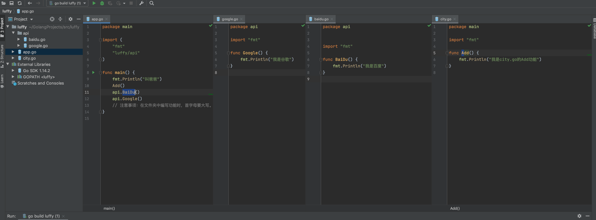

# go day02

### 包管理

- 总结
    - 一个文件夹可以称为一个包
    - 在文件夹（包） 可以创建多个go文件
    - 同一个包下，每个文件的 '包名' 相同
  
    


- 如何区分 main包 和非main包。包的分类
    - main包 必须写一个 main 函数，此函数就是项目的入口。编译生成一个可执行文件
    - 非main包，用来将代码分类，分别放在不同的包和文件中

- 注意
    - 调用其他包的功能时，需要先import导入，再使用。 调用自己包中的功能时，无须导入
    - 文件中，函数首字母小写，表示此函数只能被当前包内部使用。首字母大写，则表示任何包都可调用

### 输出

- 内置函数
    - print()
    - println()

- fmt 包（推荐）
    - fmt.Print()
    - fmt.Println()

### 注释

- 单行注释， //
- 多行注释， /* */

### 数据类型

- 字符串
- 整型
- 布尔类型

```go
package main

import "fmt"

func main() {
	// 整型
	fmt.Println(666)
	fmt.Println(6 + 9)
	fmt.Println(6 - 9)
	fmt.Println(6 * 9)
	fmt.Println(16 / 9) // 商
	fmt.Println(16 % 9) // 余数

	// 字符串类型，特点：通过双引号
	fmt.Println("武沛齐")
	fmt.Println("钓鱼要掉刀鱼，刀鱼到岛上钓")
	fmt.Println("alex" + "SB")
	//fmt.Println("alex" + 666)
	fmt.Println("alex" + "666")
	// 对比
	fmt.Println("1" + "2") // 结果："12"
	fmt.Println(1 + 2)     // 结果：3

	// 布尔类型，真假
	fmt.Println(1 > 2) // false  假
	fmt.Println(1 < 2) // true   真
	fmt.Println(1 == 2)
	fmt.Println(1 >= 2)
	fmt.Println("Alex" == "sb")

	// 超前
	if 2 > 1 {
		fmt.Println("叫爸爸")
	} else {
		fmt.Println("孙子")
	}

}
```

### 变量

- 变量创建
    - 声明 + 赋值
      ```go
        var sd string = "老男孩alex"
        fmt.Println(sd)
        
        var age int = 73
        fmt.Println(age)
        
        var flag bool = true
        fmt.Println(flag)
      ```
    - 先声明后赋值
      ```go
        // 声明了一个字符类型变量 sd
        var sd string
        // 给sd变量赋值
        sd = "老男孩alex"
        fmt.Println(sd)
      ```
- 变量名要求
    - 变量名必须只包含：字母、数字、下划线
    - 数字不能开头
    - 不能使用go语言内置的关键字
      ```go
          break、default、func、interface、select、
          case、defer、go、map、struct、chan、else、
          goto、package、switch、const、fallthrough、
          if、range、type、continue、for、import、return、var
      ```

- 变量建议
    - 变量名见名知意：name/age/num ; v1、v2、v3
    - 驼峰式命名：myBossName / startDate


- 变量简写
  ```go
  var name string = "shdeng"
  
  var name = "shdeng"
  
  name:="shdeng" // 推荐
  
  var name,age,school string // 批量生命变量
  name="shdeng"
  age = "18"
  school = "河南"
  ```

- 因式分解 简写变量
   ```go
   package main
   
   import "fmt"
   
   func main() {
   
       var (
           name           = "shdeng"
           age            = 30
           hobby          = "jiuba"
           gender         string // 只声明不赋值，默认值是："" 空字符串
           lenth          int    // 只声明不赋值，默认值是：0
           has_girlfriend bool   //  只声明但不赋值， 默认值是：false
       )
       fmt.Println(name, age, hobby, gender, lenth, has_girlfriend)
   
   }

   ```
    - 只声明，不使用会报错。


- 变量作用域
    - 在函数，或者大括号{} 内部定义了变量，仅限当前作用域内使用
        - 不能被上级使用
        - 可以在同一级使用
        - 可以被子级使用
            ```go
            package main
            import "fmt"
            func main() {
            name := "shdeng"
            fmt.Println(name)
            if true {
                age := 18
                name := "alex"
                fmt.Println(age)
                fmt.Println(name)
            }
            fmt.Println(name)
            }
           ```
- 全局变量 和 局部变量
    - 全局变量，未写在函数中的变量为全局变量，不可以是用v1:=xx 方式简化，可以基于因式分解方式声明多个变量，项目中寻找变量最后一次出现的值
    - 局部变量，编写在{} 内部的变量，可以任意形式简化，可以基于因式分解声明多个变量
  ```go
   package main

   import "fmt"
   
   // 全局变量（不能以省略的方式）
   var school string = "哈哈哈" // 可以
   //var school = "哈哈哈" 	 // 可以
   //school := "哈哈哈"  		 // 不可以
   
   var (
       v1 = 123
       v2 = "你好"
       v3 int
   )
   
   func main() {
   
       name := "shdeng" // 局部变量
       fmt.Println(name)
       if true {
           age := 18      // 局部变量
           name := "alex" // 局部变量
           fmt.Println(age)
           fmt.Println(name)
       }
       fmt.Println(name)
       fmt.Println(school)
       fmt.Println(v1, v2, v3)
   }
  ```

### 赋值及内存相关

- 使用int、string、bool这三种数据类型时，如果遇到变量的赋值则会拷贝一份。【值类型】
   ```go
   name :="shdeng"
   nicename := name // 值拷贝一份，地址重新创建
   fmt.Println(name, &name) // & 取地址
   fmt.Println(nickname, &nickname) 
   ```

### 常量

- 常量不可修改
- 常量使用 const 关键字定义
- 常量不支持 v1:= 1 (这样是变量的简写) ，也不支持只声明不赋值
  ```go
    package main
    
    import "fmt"
    
    const v4 int  // 错误
    const v2 = "123" // 正确
    
    // 因式分解
    const (
    v1 = 1
    v3 = 3
    )
    
    func main() {
        fmt.Println(v1, v2, v3)
    }

  ```
- 支持因式分解
    ```go
      // 因式分解
      const (
          v1 = 1
          v3 = 3
      )
      
      func main() {
          fmt.Println(v1, v2, v3)
      }
    ```
- iota 自增计数器
  ```go
    package main
    
    const (
        monday = iota + 1
        tuesday
        wednesday
        thursday
        friday
        saturday
        sunday
    )
    
    const (
        n1 = iota
        n2
        n3
    )

    func main() {
    
        // iota
        // 示例1
        /*
            const (
                v1 = 1
                v2 = 2
                v3 = 3
                v4 = 4
                v5 = 5
            )
            fmt.Println(v1, v2, v3, v4, v5)
        */
    
        // 示例2
        /*
            const (
                v1 = iota
                v2
                v3
                v4
                v5
            )
            fmt.Println(v1, v2, v3, v4, v5)
        */
    
        // 示例3
        /*
            const (
                v1 = iota + 2
                v2
                v3
                v4
                v5
            )
            fmt.Println(v1, v2, v3, v4, v5)
        */
    
        // 示例4：
        /*
            const (
                v1 = iota + 2
                _
                v2
                v3
                v4
                v5
            )
            fmt.Println(v1, v2, v3, v4, v5)
        */
  }
    ```

### 输入

- fmt.Scan // 输入不换行，必须等待输入完成才终止
  ```go
    package main
    
    import "fmt"
    
    func main() {
    // 示例1：fmt.Scan
    /*
    var name string
    fmt.Println("请输入用户名：")
    fmt.Scan(&name)
    fmt.Printf(name)
    */

    // 示例2：fmt.Scan
    var name string
    var age int
    
    fmt.Println("请输入用户名：")
    // 当使用Scan时，会提示用户输入
    // 用户输入完成之后，会得到两个值：count,用户输入了几个值；err，用输入错误则是错误信息
    
    _, err := fmt.Scan(&name, &age) // _ 表示 匿名变量
    
    if err == nil {
        fmt.Println(name, age)
    } else {
        fmt.Println("用户输入数据错误", err)
    }
    // 特别说明：fmt.Scan 要求输入两个值，必须输入两个，否则他会一直等待。
    }

  ``
- fmt.Scanln // 换行即输入结束
  ```go
    package main
    
    import "fmt"
    
    func main() {
    // 示例1：fmt.Scanln
    /*
    var name string
    fmt.Print("请输入用户名：")
    fmt.Scanln(&name)
    fmt.Printf(name)
    */

    // 示例2：fmt.Scanln
    var name string
    var age int
    fmt.Print("请输入用户名：")
    // 当使用Scanln时，会提示用户输入
    // 用户输入完成之后，会得到两个值：count,用户输入了几个值；err，用输入错误则是错误信息
    count, err := fmt.Scanln(&name, &age)
    fmt.Println(count, err)
    fmt.Println(name, age)

    // 特别说明：fmt.Scanln 等待回车。
    }
  ```
- fmt.Scanf //格式化输入
    ```go
    package main
    import "fmt"
    
    func main() { var name string var age int
    
        fmt.Print("请输入用户名：")
        _, _ = fmt.Scanf("我叫%s 今年%d 岁", &name, &age) // 如果有两个匿名变量，直接使用 = ，不使用:= 接收结果
        fmt.Println(name, age)
    
    }
  ```

- 处理 fmt.Scanfln // 遇到换行 ，就结束输入
```go
package main

import (
	"bufio"
	"fmt"
	"os"
	"reflect"
)

func main() {
	// os.Stdin 是标准输入
	// bufio 是 读取文本模块
	reader := bufio.NewReader(os.Stdin)
	// line，从stdin中读取一行的数据（字节集合 -> 转化成为字符串）
	// reader默认一次能4096个字节（4096/3)
	//    1. 一次性读完，isPrefix=false
	// 	  2. 先读一部分，isPrefix=true，再去读取isPrefix=false

	line, _, _ := reader.ReadLine()      //  接收输入数据
	fmt.Println(reflect.TypeOf(line))    // []uint8
	fmt.Println(reflect.TypeOf(line[0])) // uint8
	data := string(line)
	fmt.Println(data)
}

```

  ### 条件语句

```go
    // 方式一
if 条件 {
成立后，此代码块执行
}else{
不成立，此代码块执行
}

// 方式二
if 条件 {
成立后，此代码块执行
}
```

- 多条件判断

```go
    if 条件A{
...
}else if 条件B{
...
}else if 条件C{
...
}else{
...
}
```

- 示例

```go
    package main

import "fmt"

func main() {
	var length int
	fmt.Print("请输入你的长度：")
	fmt.Scanln(&length)

	if length < 1 {
		fmt.Println("没用的东西，还特么是坑")
	} else if length < 6 {
		fmt.Println("刚刚能用")
	} else if length < 18 {
		fmt.Println("生活和谐")
	} else {
		fmt.Println("太特么大了")
	}
}
```

- 条件嵌套

```go
package main

import "fmt"

func main() {
	fmt.Println("欢迎致电10086，1.话费相关；2.业务办理；3.人工服务。")

	var number int
	fmt.Scanln(&number)

	if number == 1 {
		fmt.Println("话费服务，1.交话费；2.查询。")
		var n1 int
		fmt.Scanln(&n1)
		if n1 == 1 {
			fmt.Println("缴话费啦")
		} else if n1 == 2 {
			fmt.Println("查话费了")
		} else {
			fmt.Println("输入错误")
		}
	} else if number == 2 {
		fmt.Println("业务办理")
	} else if number == 3 {
		fmt.Println("人工服务")
	} else {
		fmt.Println("输入错误")
	}

	// 建议：条件的嵌套不要太多
}
```