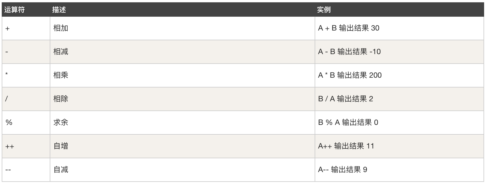
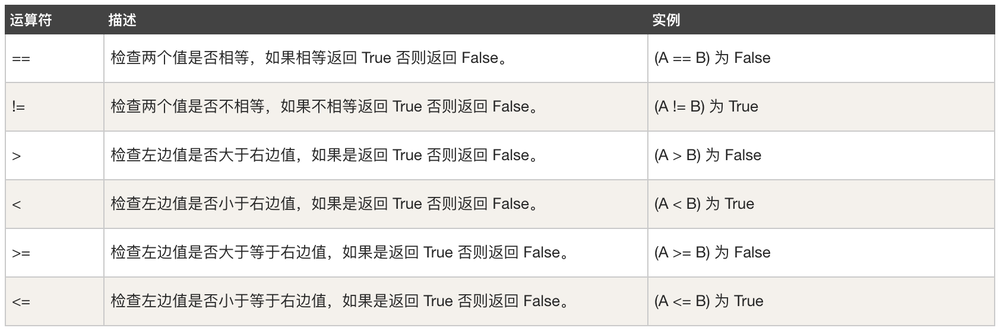
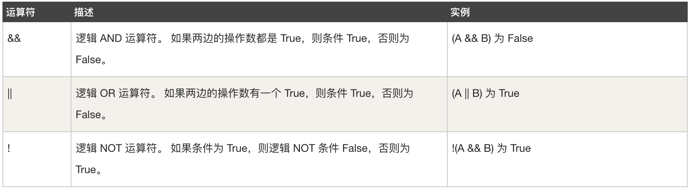
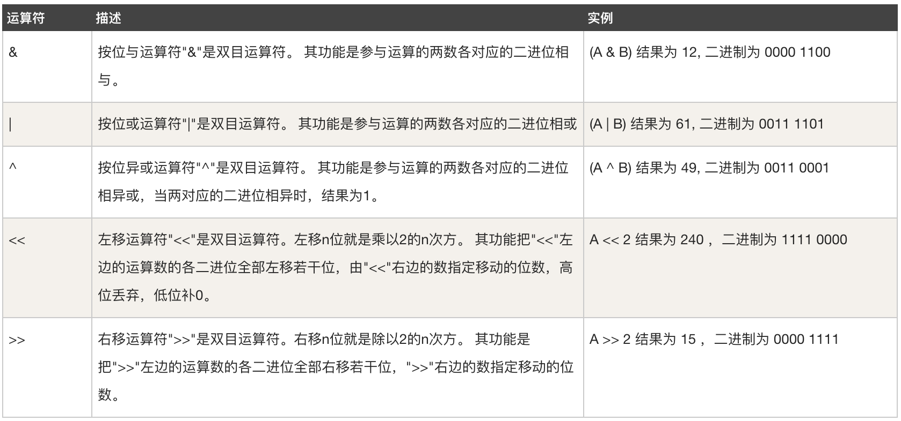
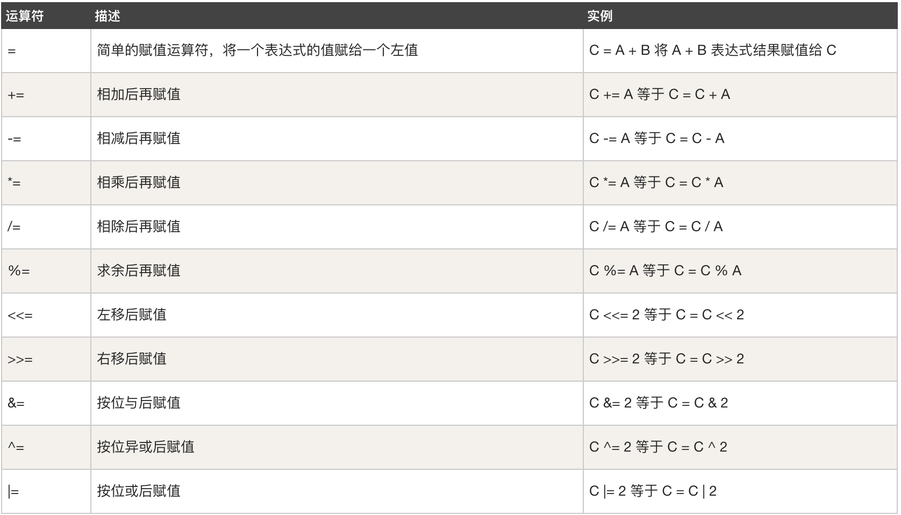

# day03

### switch case default 条件判断语句

```go

package main

import "fmt"

func main() {

	// 1. switch 条件表达式

	switch 1 + 2 {
	case 1:
		fmt.Println(1)

	case 2:
		fmt.Println(2)

	case 3:
		fmt.Println(3)
	default:
		fmt.Println(4)
	}

	// 2. switch 变量
	var page int
	fmt.Scan(&page)
	switch page {
	case 1:
		fmt.Println(1)

	case 2:
		fmt.Println(2)

	case 3:
		fmt.Println(3)
	default:
		fmt.Println(4)
	}

}

```

### for 循环

- for 循环 方法1
    ```go
    package main
    
    import (
        "fmt"
        "time"
    )
    
    func main() {
        // 1. 真true 循环 ,死循环
        for {
            fmt.Println("1234")
            time.Sleep(time.Second * 1)
        }
    
        // 2. 条件循环，条件判断也是  布尔结果
        for 2 > 1 {
            fmt.Println("1234")
            time.Sleep(time.Second * 1)
        }
        // 3. 变量判断
        number := 1
        for number < 4 {
            fmt.Println("1234", &number)
            time.Sleep(time.Second * 1)
            number += 1         // 重新赋值
            number = number + 1 // 重新赋值
        }
    }
    
    ```
- for 循环方法2

```go
package main

import "fmt"

func main() {
	// 方式 1
	for i := 1; i < 10; {
		fmt.Println(i)
		i += 1
	}

	//方式 2
	// i++  等同于 i=i+1
	for i := 1; i < 10; i++ {
		fmt.Println(i)
	}

}
```

- continue 中断语句

```go
 for i := 1; i<=10; i++{
if i == 7{
continue
}
fmt.Println(i)
}
```

- break 中断语句
  ```go
    fmt.Print("开始")
    data := 66
    for{
        var userInputNumber int
        fmt.Print("请输入数字：")
        fmt.Scanln(&userInputNumber)
        if userInputNumber > data {
            fmt.Println("大了")
        } else if userInputNumber < data {
            fmt.Println("小了")
        } else {
            fmt.Println("恭喜你猜对了")
            break
        }
    }
    fmt.Print("结束")
  ```
- 循环嵌套
  ```go
  for i:=1;i<3;i++{
      // i=1
      // i=2
      for j:=1;j<5;j++{
          // j=1/2/3/4
          if j == 3{
              break // 内层循环 为3 时，中断内部循环一次
          }
          fmt.Println(i,j)
      }
  }
  ```
- 对for进行打标签，然后通过break和continue就可以实现多层循环的跳出和终止。
  ```go
  package main
  
  import "fmt"
  
  func main() {
  
  // go 循环之打标签 break/continue
  f1:
      for i := 1; i < 10; i++ {
          for j := 1; j < 10; j++ {
              if j == 4 {
                  fmt.Println("跳转到指定标签")
                  continue f1 // 跳出当前循环，执行标签位置语句
              }
              fmt.Printf("i:%d,j:%d\n", i, j)
          }
      }
  fmt.Println("")
  f2:
      for i := 1; i < 10; i++ {
          for j := 1; j < 10; j++ {
              if j == 4 {
                  fmt.Println("跳转到指定标签")
                  break f2 // 直接中断
              }
              fmt.Printf("i:%d,j:%d\n", i, j)
          }
      }
  }
  
  ```

### goto 语法 （不推荐）

- 跳跃到指定的行，然后向下执行代码。
  ```go
  package main
  
  import "fmt"
  
  func main() {
      var name string
      fmt.Print("请输入姓名：")
      fmt.Scan(&name)
  
      if name == "shdeng" {
          goto SVIP
      } else if name == "deng" {
          goto VIP
      }
  // goto 特性，不return 会将一下的 fmt.Println(xxx) 全部执行，增加return 以main函数形式返回结果
      fmt.Println("需要预约。。。")
      return
  VIP:
      fmt.Println("须等待。。。。")
      return
  
  SVIP:
      fmt.Println("无须等待，直接进入")
      return
  
  }
  
  ```

### 字符串格式化 ，拼接数据

- Sprintf
  ```go
  package main
  
  import "fmt"
  
  func main() {
      var name, address, action string
  
      fmt.Print("请输入姓名：")
      fmt.Scanln(&name)
  
      fmt.Print("请输入位置：")
      fmt.Scanln(&address)
  
      fmt.Print("请输入行为：")
      fmt.Scanln(&action)
  
      result := fmt.Sprintf("我叫%s,在%s正在%s", name, address, action)
      //result := "我叫" + name + "在" + address + "干" + action
      fmt.Println(result)
  }
  
  ```

### 运算符，位运算符

- 算数运算符
  

- 关系运算符
  

- 逻辑运算符
  

- 位运算符
  

- 赋值运算符
  
  

### 二进制 转 十进制
```go
// 索引 从0 开始，倒着数
10101         ->   2**4 + 2**2 + 2**0 = > 16 + 4 + 1 = > 21
101010010101  ->   2**11 + 2**9 + ....
```

### 十进制 转 二进制
```go
// 99 拆分成 2的倍数
99  -> 64 + 32 + 2 + 1  -> 2**6 + 2**5 + 2**1 + 2*0  -> 1100011
```

### 位运算指的是二进制之间的运算
```go
// 1.按位进行与运算（全为1，才得1）
r1 := 5 & 99
5  -> 0000101
99 -> 1100011
      0000001   -> 1

// 2.按位进行或运算（只要有1，就得1）
r2 := 5 | 99
5  -> 0000101
99 -> 1100011
      1100111   -> 2**6 + 2**5 + 2**2 + 2**1 + 2**0 = 64 + 32 + 4 + 2 + 1 = 103

// 3.按位进行异或运算（上下不同，就得1）
r3 := 5 ^ 99
5  -> 0000101
99 -> 1100011
      1100110   -> 2**6 + 2**5 + 2**2 + 2**1 = 64 + 32 + 4 + 2 = 102

// 4.按位向左移动
r4 := 5 << 2
        5  -> 101
向左移动2位  -> 10100  -> 2**4 + 2**2 = 16 + 4 = 20 

// 5.按位向右移动
r5 := 5 >> 1
        5  -> 101
向右移动1位  -> 10  -> 2**1 = 2

// 6.比较清除   // 以前面的值为基准，让前面的和后面的值的二进制位进行比较，如果两个位置都是1，则讲前面的值的那个位置置0
r6 := 5 &^ 99
5  -> 0000101
99 -> 1100011
      0000100     -> 2**2 = 4
```

### 运算符的优先级
```go
// 记不住优先级，就使用()包起来。
Precedence    Operator
    5             *  /  %  <<  >>  &  &^
    4             +  -  |  ^
    3             ==  !=  <  <=  >  >=
    2             &&
    1             ||

```

#### golang 官网
https://golang.org/ref/spec#Arithmetic_operators