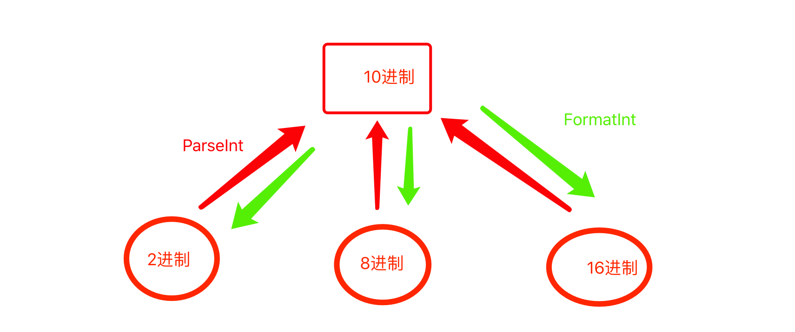
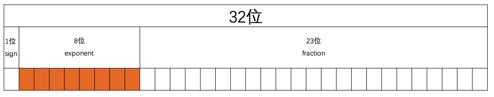

# day 05 数据类型

### 常见数据类型

- 整型
- 浮点型
- 布尔类型
- 字符串
- 数组，用于`表示`多个数据 （数据集合）


关于值类型和引用类型 ：https://github.com/go101/go101/wiki/About-the-terminology-%22reference-type%22-in-Go

### 整型

###### 整型分类

- 有符号 公式：2**n 到 2**n-1
    - int8 （-128 -> 127）
    - int16 （-32768 -> 32767）
    - int32 （-2,147,483,648 -> 2,147,483,647）
    - int64 （-9,223,372,036,854,775,808 -> 9,223,372,036,854,775,807）
    - int

- 无符号 公式：0 到 2**n
    - uint8 （0 -> 255）
    - uint16 （0 -> 65,535）
    - uint32 （0 -> 4,294,967,295）
    - uint64 （0 -> 18,446,744,073,709,551,615）

- 操作系统
    - 32 位操作系统 ： 2**32
    - 64 位操作系统 ： 2**64

- 备注： 根据不同的需求，选择适合的数据类型。

###### 整型之间的转换

```go
data := intXXX(其他整型)
```

```go
var v1 int8 = 10
var v2 int16 = 120
v3 := int16(v1) + v2
fmt.Println(v3, reflect.TypeOf(v3)) // 130 int16

```

- 低位转高位，没问题
- 高位转低位，存在问题

```go
var v4 int8 = 10
var v5 int64 = 2022
v6 := int64(v4)
v7 := int8(v5)
fmt.Println("低位转向高位：", v6) // 低位转向高位： 10
fmt.Println("高位转向低位：", v7) // 高位转向低位：  -26 , 超过127 就会重新开始从-128开始循环
```

###### 整形和字符串转换

```go
a1 := 19
strRes := strconv.Itoa(a1)
fmt.Println("数字转字符串：", strRes) //数字转字符串： 19

a2 := "666"
intRes, _ := strconv.Atoi(a2)
fmt.Println("字符串转数字", intRes) //字符串转数字 666
```

###### 整型进制转换 （默认整型就是10进制）

```go
// 整型进制转换 （默认整型就是10进制）
// - go语言中，整型就是十进制
// - 其他进制就是 以字符串的形式存在
q1 := 99
// base 是进制种类：2，8，10，16
hexResult := strconv.FormatInt(int64(q1), 2)
fmt.Println("整型进制转换：", hexResult, reflect.TypeOf(hexResult)) // 整型进制转换： 1100011 string

// 字符串转数值类型
q2 := "111001"
strResHex, err := strconv.ParseInt(q2, 10, 0)
fmt.Println("2进制转10进制", strResHex, "错误：", err, "类型：", reflect.TypeOf(strResHex)) //2进制转10进制 111001 错误： <nil> 类型： int64

// 转其他进制 ，只能低转高，不能高转低。
q3 := "270f" // 16进制
strResHexQ3, err := strconv.ParseInt(q3, 16, 0)
fmt.Println("2进制转16进制", strResHexQ3, "错误：", err, "类型：", reflect.TypeOf(strResHexQ3)) // 16进制字符串转10进制 9999 错误： <nil> 类型： int64

``` 



###### 数学运算符

```go
fmt.Println(math.Abs(-19)) // 绝对值
fmt.Println(math.Floor(3.14)) // 向下取整
fmt.Println(math.Ceil(3.14)) // 向上取整
fmt.Println(math.Round(3.3478)) // 就近取整
fmt.Println(math.Mod(11, 3)) // 取余数，同 11 % 3 =1
fmt.Println(math.Pow(2, 5)) // 幂次计算
fmt.Println(math.Pow10(2)) // 计算10次方，2的十次方
fmt.Println(math.Max(1, 2)) // 比较两个大小，取大
fmt.Println(math.Min(1, 2)) // 比较两个大小，取小
```

###### 整型指针类型/nil空类型

- 变量声明

```go
// 直接v1给变量开辟空间，且赋值
var v1 int
v2 := 999
```

- 指针

```go
var v3 *int
v4 := new(int) // new 函数 ， 开辟内存空间，返回一个指针类型的数据，int 默认值为：0
```

- 指针的目的，节约空间

###### 超大整型

- 超大整型 变量和指针示例

```go
package main

import (
	"fmt"
	"math/big"
)

func main() {

	// 变量创建超大整型
	// 第一步创建 超大整型对象
	var v1 big.Int
	var v2 big.Int

	// 第二部，给超大整型赋值
	v1.SetInt64(9223372036854775807)
	v1.SetInt64(92233720368547758089223372036854775808) // 容易产生溢出问题
	fmt.Println(v1)

	v2.SetString("92233720368547758089223372036854775808", 10) // 不会产生溢出问题
	fmt.Println(v2)

	// 指针创建超大整型
	var v3 = new(big.Int)
	var v4 = new(big.Int)

	// 第二部，给超大整型赋值
	v3.SetInt64(9223372036854775807)
	fmt.Println(v1)

	v4.SetString("92233720368547758089223372036854775808", 10) // 不会产生溢出问题
	fmt.Println(v4)

}

``` 

- 超大整型加减乘除 : add, sub, mul, div, divmod, NewInt 函数

```go
package main

import (
	"fmt"
	"math/big"
	"reflect"
)

func main() {

	n1 := new(big.Int)
	n1.SetInt64(1000)
	n2 := new(big.Int)
	n2.SetInt64(33)

	result1 := new(big.Int)
	result1.Add(n1, n2)

	fmt.Println(result1, reflect.TypeOf(result1)) // 3102 *big.Int

	//  NewInt 是big模块对指针类型的缩写
	n3 := big.NewInt(29)

	n4 := big.NewInt(221)
	result2 := new(big.Int)
	result2.Add(n3, n4)
	fmt.Println(result2)

	// 超大整型，加减乘除

	result := new(big.Int)
	result.Add(n1, n2) // 加法,仅限两个元素
	fmt.Println("超大整型加法：", result)

	result.Sub(n1, n2) // 减法,仅限两个元素
	fmt.Println("超大整型减法：", result)

	result.Mul(n1, n2) // 乘法,仅限两个元素
	fmt.Println("超大整型乘法：", result)

	result.Div(n1, n2) // 除法,仅限两个元素
	fmt.Println("超大整型除法：", result)

	minder := new(big.Int)        // 余数
	result.DivMod(n1, n2, minder) // 除法求余数,仅限两个元素
	fmt.Println("超大整型取余数：", result, minder)

}

```

- 超大整数相加示例

```go
n1 := new(big.Int)
n1.SetString("92233720368547758089223372036854775808", 10)

n2 := new(big.Int)
n2.SetString("11111192233720368547758089223372036854775808", 10)

result := new(big.Int)
result.Add(n1, n2)

fmt.Println(result.String()) // result.String() 将相加后的结果，以字符串的形式展示
```

- 建议
    - 尽量使用 new 指针类型初始化 超大整型/浮点型
    - int 类型 和 *int 是两种数据类型 。 前者再内存中指向`数据地址`，后者指针仅指向`地址`

### 浮点型

###### 浮点类型

- float32 用32位（4个字节）来存储浮点型
- float64 用64位（8个字节）来存储浮点型

```go
package main

import "fmt"

func main() {
	var v1 float32
	v1 = 3.14
	v2 := 99.9
	v3 := float64(v1) + v2
	fmt.Println(v1, v2, v3)
}

```

###### 非精确

- 小数部分以非精确的形式表示

```go
package main

import (
	"fmt"
)

func main() {
	var v1 float32
	v1 = 3.14
	v2 := 99.9
	v3 := float64(v1) + v2 // 同类型数据，才能做处理

	fmt.Println(v1, v2, v3) // 3.14 99.9 103.04000010490418

	// 上述  103.04000010490418 结果，就是非精确方式 ，在举例
	v4 := 0.1
	v5 := 0.2
	result1 := v4 + v5
	fmt.Println(result1) // 0.30000000000000004

	v6 := 0.3
	v7 := 0.2
	result2 := v6 + v7
	fmt.Println(result2) // 0.5
}

```

###### float 底层原理

- 举例

```go
var price float32 = 0.29
```

- 第一步 ： 浮点型转换为二进制
    - 整数部分，直接转换为二进制
    - 小数部分，让小数部分 *2。 结果小于1，则将结果继续 *2 ，结果大于1，则将 （结果-1）*，当结果==1时，结束
      ```go
      0.29 * 2 = 0.58       // 小于1，则继续乘
      0.58 * 2 = 1.16		  // 大于1，则减1继续乘
      0.16 * 2 = 0.32		  // 小于1，则继续乘
      0.32 * 2 = 0.64       // 小于1，则继续乘
      0.64 * 2 = 1.28       // 大于1，则减1继续乘
      0.28 * 2 = 0.56       // 小于1，则继续乘
      0.56 * 2 = 1.12       // 大于1，则减1继续乘
      0.12 * 2 = 0.24       // 小于1，则继续乘    
      0.24 * 2 = 0.48       // 小于1，则继续乘
      0.48 * 2 = 0.96       // 小于1，则继续乘
      0.96 * 2 = 1.92       // 大于1，则减1继续乘
      0.92 * 2 = 1.84       // 大于1，则减1继续乘
      0.84 * 2 = 1.68       // 大于1，则减1继续乘
      0.68 * 2 = 1.36       // 大于1，则减1继续乘
      0.36 * 2 = 0.72       // 小于1，则继续乘
      0.72 * 2 = 1.44       // 大于1，则减1继续乘
      0.44 * 2 = 0.88       // 小于1，则继续乘
      0.88 * 2 = 1.76       // 大于1，则减1继续乘
      0.76 * 2 = 1.52       // 大于1，则减1继续乘
      0.52 * 2 = 1.04       // 大于1，则减1继续乘
      0.04 * 2 = 0.08       // 小于1，则继续乘
      0.08 * 2 = 0.16       // 小于1，则继续乘
      0.16 * 2 = 0.32       // 小于1，则继续乘（与第三行相同，这样会一直循环执行下去）
      ...
      
      将相乘之后等结果的整数部分拼接起来，所以 0.29的 二进制表示：010010100011110101110000101000111...
      
      ```
- 第二步 科学计数法表示
  ` 1.00111010010100011110101110000101000111... * 2^5 `
- 第三步 存储 ， 以float32类型为例
    - sign 用1位来表示浮点数的正负 。 0表示正数，1表示负数
    - exponent 用8位来表示共有256种（0~255），含正负值（-127 ~ 128）。
        - 5想要存储到exponent位的话，需要让 5 + 127 = 132，再讲132转换二进制，存储到exponent。（132的二进制是：01000010）
    - fraction 存储小数点后所有数据
      

###### decimal 模块

- 安装 decimal 模块

```
// 会在 $GOPATH/src 目录下出现该目录。
go get github.com/shopspring/decimal 
```

- 使用 decimal

```go
package main

import (
	"fmt"
	"github.com/shopspring/decimal"
)

func main() {
	var v1 = decimal.NewFromFloat(222.321321)
	var v2 = decimal.NewFromFloat(0.321321)

	var v3 = v1.Add(v2)
	var v4 = v1.Sub(v2)
	var v5 = v1.Mul(v2)
	var v6 = v1.Div(v2)
	var v7 = v1.DivRound(v2, 3) // 会进行四舍五入
	fmt.Println(v1)             //222.321321
	fmt.Println(v2)             //0.321321
	fmt.Println(v3)             //222.642642
	fmt.Println(v4)             //222
	fmt.Println(v5)             //71.436509185041
	fmt.Println(v6)             //691.8978871595694026
	fmt.Println(v7)             //691.9
}

```

### 布尔类型

- 表示真假，一般是和条件等配合使用，用于满足某个条件时，执行某个操作。

```go
package main

import (
	"fmt"
	"reflect"
	"strconv"
)

func main() {
	// 字符串转换布尔类型
	// true: "1", "t", "T", "true", "TRUE", "True"
	// false:" 0", "f", "F", "false", "FALSE", "False"
	v1, err := strconv.ParseBool("1")
	fmt.Println(v1, "数据类型:", reflect.TypeOf(v1), "错误信息：", err) // true 数据类型: bool 错误信息： <nil>

	// 布尔类型转换字符串
	v2 := strconv.FormatBool(false)
	fmt.Println(v2, "数据类型:", reflect.TypeOf(v2)) // false 数据类型: string

}

```

### 字符串

` 字符串来进行文本的处理`

###### 字符串底层原理

- 计算机中所有的操作和数据最终都是二进制，即：1000100001011...
- Go语言中的字符串是utf-8编码的序列。

```go
package main

import (
"fmt"
"reflect"
"strconv"
"unicode/utf8"
)

func main() {

	// unicode字符集：文字 -> 码点（ucs4, 4个字节表示）
	// utf-8编码，对unicode字符集的码点进行编码最终得到：1000100001

	//1。 本质是utf-8编码的序列
	var name string = "指染未来"
	fmt.Println(name[0], "字符串转2进制：", strconv.FormatInt(int64(name[0]), 2), "数据类型：", reflect.TypeOf(name[0]))
	fmt.Println(name[1], "字符串转2进制：", strconv.FormatInt(int64(name[2]), 2), "数据类型：", reflect.TypeOf(name[1]))
	fmt.Println(name[2], "字符串转2进制：", strconv.FormatInt(int64(name[2]), 2), "数据类型：", reflect.TypeOf(name[2]))
	fmt.Println(name[3], "字符串转2进制：", strconv.FormatInt(int64(name[3]), 2), "数据类型：", reflect.TypeOf(name[3]))
	fmt.Println(name[4], "字符串转2进制：", strconv.FormatInt(int64(name[4]), 2), "数据类型：", reflect.TypeOf(name[4]))
	fmt.Println(name[5], "字符串转2进制：", strconv.FormatInt(int64(name[5]), 2), "数据类型：", reflect.TypeOf(name[5]))
	fmt.Println(name[6], "字符串转2进制：", strconv.FormatInt(int64(name[6]), 2), "数据类型：", reflect.TypeOf(name[6]))
	fmt.Println(name[7], "字符串转2进制：", strconv.FormatInt(int64(name[7]), 2), "数据类型：", reflect.TypeOf(name[7]))
	fmt.Println(name[8], "字符串转2进制：", strconv.FormatInt(int64(name[8]), 2), "数据类型：", reflect.TypeOf(name[8]))
	fmt.Println(name[9], "字符串转2进制：", strconv.FormatInt(int64(name[9]), 2), "数据类型：", reflect.TypeOf(name[9]))
	fmt.Println(name[10], "字符串转2进制：", strconv.FormatInt(int64(name[10]), 2), "数据类型：", reflect.TypeOf(name[10]))
	fmt.Println(name[11], "字符串转2进制：", strconv.FormatInt(int64(name[11]), 2), "数据类型：", reflect.TypeOf(name[11]))
	/*
		// 上面的结果
		230 字符串转2进制： 11100110 数据类型： uint8
		140 字符串转2进制： 10000111 数据类型： uint8
		135 字符串转2进制： 10000111 数据类型： uint8
		230 字符串转2进制： 11100110 数据类型： uint8
		159 字符串转2进制： 10011111 数据类型： uint8
		147 字符串转2进制： 10010011 数据类型： uint8
		230 字符串转2进制： 11100110 数据类型： uint8
		156 字符串转2进制： 10011100 数据类型： uint8
		170 字符串转2进制： 10101010 数据类型： uint8
		230 字符串转2进制： 11100110 数据类型： uint8
		157 字符串转2进制： 10011101 数据类型： uint8
		165 字符串转2进制： 10100101 数据类型： uint8
	*/

	// 2。 获取字符串长度 (字节长度)
	fmt.Println(len(name)) // 12

	//3. 将字符串转换成 一个 "字节集合"
	byteList := []byte(name)
	fmt.Println(byteList) // [230 140 135 230 159 147 230 156 170 230 157 165]

	//4。将`字节集合`转换成字符串
	byteList2 := []byte{230, 140, 135, 230, 159, 147, 230, 156, 170, 230, 157, 165}
	byteToStr1 := string(byteList)
	byteToStr2 := string(byteList2)
	fmt.Println(byteToStr1, byteToStr2) // 指染未来 指染未来

	// 5. 将  字符串 转换为 unicode 字符集码典 集合, 使用rune函数
	unicodeList := []rune(name)
	fmt.Println(unicodeList)                                                 // [25351 26579 26410 26469] 这是 十进制的数据
	fmt.Println(unicodeList[0], strconv.FormatInt(int64(unicodeList[0]), 2)) //25351 110001100000111
	fmt.Println(unicodeList[1], strconv.FormatInt(int64(unicodeList[1]), 2)) //26579 110011111010011
	fmt.Println(unicodeList[2], strconv.FormatInt(int64(unicodeList[2]), 2)) //26410 110011100101010
	fmt.Println(unicodeList[3], strconv.FormatInt(int64(unicodeList[3]), 2)) //26469 110011101100101

	// 6. rune 集合 转换成字符串
	runeList := []rune{25351, 26579, 26410, 26469}
	runeToStr := string(runeList)
	fmt.Println(runeToStr) //指染未来

	// 7. 字符串，以字符形式获取长度
	stringLength := utf8.RuneCountInString(name)
	fmt.Println(stringLength) //4
}

```

###### 字符串常见功能

- 获取长度

```go
package main

import (
	"fmt"
	"unicode/utf8"
)

func main() {

	var name string = "邓周"
	fmt.Println(len(name))                    // 获取字节长度 ， utf8 一个字符占3个字节
	fmt.Println(utf8.RuneCountInString(name)) // 获取字符长度 ， 2个字符
}

```

- 是否以xx开头

```go
package main

import (
	"fmt"
	"strings"
)

func main() {
	name := "织染未来"
	result1 := strings.HasPrefix(name, "织染")
	result2 := strings.HasPrefix(name, "染")
	fmt.Println(result1, result2) // true false

}

```  

- 是否以xx结尾

```go
package main

import (
	"fmt"
	"strings"
)

func main() {
	name := "织染未来"
	result1 := strings.HasSuffix(name, "来")
	result2 := strings.HasSuffix(name, "来1")
	fmt.Println(result1, result2) // true false

}

```  

- 是否包含

```go
package main

import (
	"fmt"
	"strings"
)

func main() {

	name := "测试"
	result := strings.Contains(name, "测")
	fmt.Println(result) //true
}

```  

- 变大写

```go
package main

import (
	"fmt"
	"strings"
)

func main() {
	name := "wu"

	result := strings.ToUpper(name)

	fmt.Println(result) // 输出：WU
}

// 注意：result是大写；name依然是小写。
``` 

- 变小写

```go
package main

import (
	"fmt"
	"strings"
)

func main() {
	name := "WU"

	result := strings.ToLower(name)

	fmt.Println(result) // 输出：wu
}

```  

- 去两边

```go
package main

import (
	"fmt"
	"strings"
)

func main() {
	name := "dengzhou"

	result1 := strings.TrimRight(name, "u") // 去除右边的u
	result2 := strings.TrimLeft(name, "d")  // 去除左边的d
	result3 := strings.Trim(name, "d")      // 去除两边的d

	fmt.Println(result1, result2, result3) // 输出：dengzho engzhou engzhou
}
```  

- 替换

```go
package main

import (
	"fmt"
	"strings"
)

func main() {
	name := "dengzhouzhouzhou"

	result1 := strings.Replace(name, "zhou", "yx", 1)  // 找到zhou替换为yx，从左到右找第一个替换
	result2 := strings.Replace(name, "zhou", "yx", 2)  // 找到zhou替换为yx，从左到右找前两个替换
	result3 := strings.Replace(name, "zhou", "yx", -1) // 找到zhou替换为yx，替换所有

	fmt.Println(result1, result2, result3) //dengyxzhouzhou dengyxyxzhou dengyxyxyx

}
```  

- 分割

```go
package main

import (
	"fmt"
	"strings"
)

func main() {
	name := "抬老子的意大利的炮来"
	result := strings.Split(name, "的")

	// 根据`的`进行切割，获取一个切片（类似于一个数组）
	fmt.Println(result) // [ 抬老子, 意大利, 炮来 ]
}
```

- 拼接

```go
package main

import (
	"bytes"
	"fmt"
	"strings"
)

func main() {

	// strings.Join 拼接字符串
	dataList := []string{"i", "love"}
	result1 := strings.Join(dataList, "-")
	fmt.Println(result1) //i-love

	// 建议：效率更高一些（go 1.10之前）
	var buffer bytes.Buffer
	buffer.WriteString("i")
	buffer.WriteString("l")
	buffer.WriteString("o")
	buffer.WriteString("v")
	buffer.WriteString("e")
	result2 := buffer.String()
	fmt.Println(result2)

	// 建议：效率更更更更高一些（go 1.10之后）
	var builder strings.Builder
	builder.WriteString("l")
	builder.WriteString("o")
	builder.WriteString("v")
	builder.WriteString("e")
	result3 := builder.String()
	fmt.Println(result3)
}

```  

- string转换为int

```go
package main

import (
	"fmt"
	"strconv"
)

func main() {
	num := "666"

	// 内部调用的就是 ParseInt
	var data, _ = strconv.Atoi(num)
	fmt.Println(data)

	// 整型转字符串（strconv.ParseInt 和 strconv.FormatInt 可用处理进制转换）
	// 十进制：整型； 其他进制：字符串形式 
	var result, err = strconv.ParseInt(num, 10, 32)
	fmt.Println(result, err)
}
```  

- int转换为string

```go
package main

import (
	"fmt"
	"strconv"
)

func main() {
	var result = strconv.Itoa(888)
	fmt.Println(result)
}
```  

- 字符串 和 “字节集合”

```go
package main

import (
	"fmt"
	"strconv"
	"unicode/utf8"
)

func main() {

	var name string = "武沛齐"

	// 字符串转换为一个"字节集合"
	byteSet := []byte(name)
	fmt.Println(byteSet) // [230,173,166,230,178,155,233,189,144]

	// 字节的集合转换为字符串
	byteList := []byte{230, 173, 166, 230, 178, 155, 233, 189, 144}
	targetString := string(byteList)
	fmt.Println(targetString)

}
```  

- 字符串 和 “rune集合”

```go
package main

import (
	"fmt"
	"strconv"
)

func main() {
	//字符串 和 “rune 集合”
	var name string = "邓周"
	// 将字符串 转换为unicode编码
	unicodeList := []rune(name)
	fmt.Println("Unicode编码集合：", unicodeList)                                             // Unicode编码集合： [37011 21608]
	fmt.Println(unicodeList[0], "转换为16进制", strconv.FormatInt(int64(unicodeList[0]), 16)) // 37011 转换为16进制 9093
	fmt.Println(unicodeList[1], "转换为16进制", strconv.FormatInt(int64(unicodeList[1]), 16)) // 21608 转换为16进制 5468

	// rune 集合转换为字符串
	unicodeList2 := []rune{37011, 21608}
	runeToStrResult := string(unicodeList2)
	fmt.Println(runeToStrResult) //邓周
}

``` 

- string 和 字符

```go
package main

import (
	"fmt"
	"unicode/utf8"
)

func main() {
	v1 := string(65)
	fmt.Println("字符：", v1)

	v2 := string(37001)
	fmt.Println("字符", v2)

	// 字符串 转数字
	v3, size := utf8.DecodeRuneInString("邓")
	fmt.Println("v3：", v3, "长度：", size) //v3： 37011 长度： 3

}

```

###### 索引切片和循环

```go
package main

import "fmt"

func main() {
	var name string = "邓周周邓"
	//1。 索引获取字节
	fmt.Println("字节：", name[0])
	fmt.Println("字节：", name[1])
	fmt.Println("字节：", name[2])

	//2。 切片获取区间
	newSliceRes1 := name[0:3]
	newSliceRes2 := name[3:9]
	fmt.Println("切片：", newSliceRes1, newSliceRes2)

	//3。 循环遍历字节
	for i := 0; i < len(name); i++ {
		fmt.Println("字节索引：", i, "字节值：", name[i])
	}

	//4。 range 遍历字符串
	for index, item := range name {
		fmt.Println("字符索引：", index, "字符值：", item, string(item))

	}
	//5。 rune 集合 遍历
	runeList := []rune(name)
	for _, item := range runeList {
		fmt.Println(string(item))
	}

}

```

### 数组

- 数组是连续的，且定长，元素类型一致的数据集合

```go
// 方式一：先声明再赋值（声明时内存中已开辟空间，内存初始化的值是0）
var numbers [3]int
numbers[0] = 999
numbers[1] = 666
numbers[2] = 333

// 方式二：声明+赋值
var names = [2]string{"wusir", "alex"}

// 方式三：声明+赋值 + 指定位置
var ages = [3]int{0:87, 1:73, 2:99}

// 方式四：省略个数 ...
var names = [...]string{"wusir", "alex"}
var ages = [...]int{  0:87, 2:99 }
```

- 指针类型数组 声明

```go
// 声明 指针类型的数组（指针类型），不会开辟内存初始化数组中的值，numbers = nil
var numbers *[3]int

// 声明数组并初始化，返回的是 指针类型的数组（指针类型）
numbers := new([3]int)
```

###### 数组内存管理

- 数组中的数据（元素），内存地址是连续的

```go
package main

import "fmt"

func main() {
	var numbers1 [3]int
	numbers1[1] = 1
	numbers1[2] = 2
	numbers1[0] = 3
	fmt.Printf("数组内存地址：%p \n", &numbers1)           // 数组内存地址：0xc00001e090
	fmt.Printf("数组第一个元素的内存地址0：%p \n", &numbers1[0]) //数组第一个元素的内存地址：0xc00001e090
	fmt.Printf("数组第一个元素的内存地址1：%p \n", &numbers1[1]) //数组第一个元素的内存地址1：0xc00001e098
	fmt.Printf("数组第一个元素的内存地址2：%p \n", &numbers1[2]) //数组第一个元素的内存地址2：0xc00001e0a0 

}

```  

- 数组的内存地址 ， 是第一个元素的内存地址

```go
package main

import "fmt"

func main() {
	var numbers1 [3]int
	numbers1[1] = 1
	numbers1[2] = 2
	numbers1[0] = 3
	fmt.Printf("数组内存地址：%p \n", &numbers1)       // 数组内存地址：0xc00001e090
	fmt.Printf("数组第一个元素的内存地址：%p", &numbers1[0]) //数组第一个元素的内存地址：0xc00001e090

}

```

- 每个数组字符串结构体内部包含： len（长度）+str（指针）
- 数组的结构体

```go
type stringStruct struct {
str unsafe.Pointer
len int
}
```

###### 可变和拷贝

- 数组元素可变
- 数组长度不可变
- 数据中的数据类型不可变
- copy 重新 生成一个数组变量

```go
name1 := [2]string{"武沛齐", "alex"}
name2 := name1 // name1 的地址 和 name2的地址 不一样

name1[1] = "苑昊" // 修改name1 数组，不会影响name2数组
fmt.Println(name1, name2) // [武沛齐 苑昊]   [武沛齐 alex]
```

###### 长度索引切片和循环

```go
package main

import "fmt"

func main() {
	// 1. 长度
	name := [2]string{"武沛齐", "alex"}
	fmt.Println(len(name))

	// 2. 索引
	name := [2]string{"武沛齐", "alex"}
	data := name[0]
	fmt.Println(data)
	name[0] = "eric"
	fmt.Println(name)

	// 3. 切片
	nums := [3]int32{11, 22, 33}
	data := nums[0:2] // 获取   0 <= 下标 < 2
	fmt.Println(data)

	// 4. 循环
	nums := [3]int32{11, 22, 33}
	for i := 0; i < len(nums); i++ {
		fmt.Println(i, nums[i])
	}

	// 5.for range 循环
	nums := [3]int32{11, 22, 33}
	for key, item := range nums {
		fmt.Println(key, item)
	}

	for key := range nums {
		fmt.Println(key)
	}

	for _, item := range nums {
		fmt.Println(item)
	}

}
```

###### 数组嵌套

- 数组嵌套 等同于 几维表格
-

```go
package main

import "fmt"

func main() {

	// 一维数组
	oneArray := [...]int{1, 2, 3, 4}
	fmt.Println("一维数组：", oneArray)
	// 二维数组
	twoArray := [2][3]int{{1, 2, 3}, {11, 22, 33}}
	fmt.Println("二维数组：", twoArray)
	// 三维数组
	threeArray := [2][2][3]int{{{1, 2, 3}, {11, 22, 33}}, {{1, 2, 3}, {11, 22, 33}}}
	fmt.Println("三维数组：", threeArray)
}

```