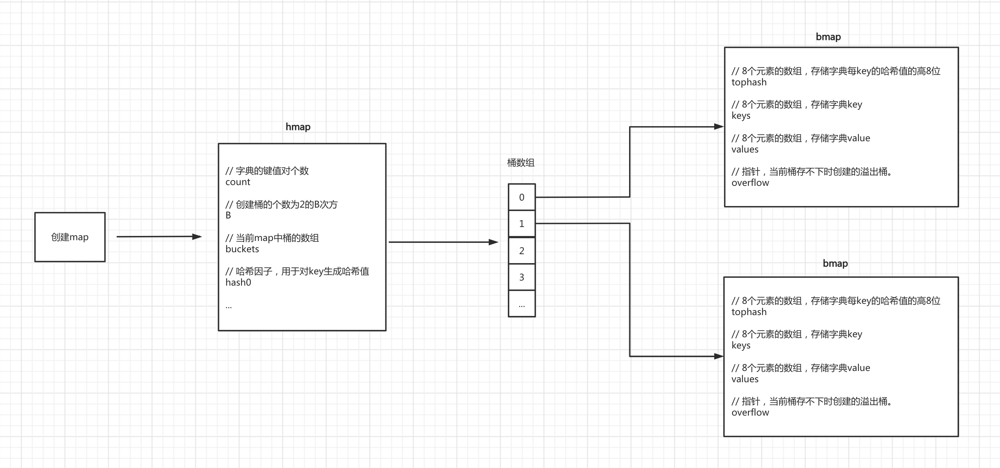

# day 06 数据类型

### 常见数据类型

- 字典Map，用于表示键值对

### 字典类型 map

- map类型又称为：字典dict/映射map，以`k:v`组合
- 示例：

```goregexp
{
    "age":"18",
    "name":"shdeng",
    "email":"shdeng@qq.com"
}
```

- 特点
    - 键名字不会重复
    - 键 必须可 hash。 go中可hash：int/bool/float/string/array数组
    - 无序
    - 查找速度快，底层基于哈希表存储。
        - 基于 取模+拉链法
        - 将 key 进行hash后，取模计算，得到索引位置
        - 拉链即：出现相同的模值，在当前索引位置，通过链表形式添加一个位置，存放数据

###### 底层原理 简介
Golang中的Map有自己的一套实现原理，其核心是由hmap和bmap两个结构体实现。
###### Map 底层原理剖析

- 初始化
    - 创建hmap结构体对象
    - 生成一个哈希因子hash0 并赋值到hmap对象中（用于后续为key创建哈希值）
    - 根据hint=10，并根据算法规则来创建 B，当前B应该为1。
    - 根据B去创建去创建桶（bmap对象）并存放在buckets数组中，当前bmap的数量应为2.
        - 当B<4时，根据B创建桶的个数的规则为：$2^B$（标准桶）
        - 当B>=4时，根据B创建桶的个数的规则为：$2^B$ +（标准桶+溢出桶）
        - 注意：每个bmap中可以存储8个键值对，当不够存储时需要使用溢出桶，并将当前bmap中的overflow字段指向溢出桶的位置。
- 写入数据
    - 结合哈希因子和键 name生成哈希值 011011100011111110111011011。
    - 获取哈希值的后B位，并根据后B为的值来决定将此键值对存放到那个桶中（bmap）。
    - 在上一步确定桶之后，接下来就在桶中写入数据。
    - hmap的个数count++（map中的元素个数+1）
- 读取数据
    - 结合哈希引子和键 name生成哈希值
    - 获取哈希值的后B位，并根据后B为的值来决定将此键值对存放到那个桶中（bmap）。
    - 确定桶之后，再根据key的哈希值计算出tophash（高8位），根据tophash和key去桶中查找数据。
    
- 扩容机制
    - 在向map中添加数据时，当达到某个条件，则会引发字典扩容。
    - map中数据总个数 / 桶个数 > 6.5 ，引发翻倍扩容
    - 使用了太多的溢出桶时（溢出桶使用的太多会导致map处理速度降低）
    
- 迁移
    - 扩容之后，必然要伴随着数据的迁移，即：将旧桶中的数据要迁移到新桶中。
    - 翻倍扩容
    - 等量扩容
@https://github.com/WuPeiqi/go_course/blob/master/day06%20%E6%95%B0%E6%8D%AE%E7%B1%BB%E5%9E%8B%EF%BC%9A%E6%8C%87%E9%92%88%E3%80%81%E5%88%87%E7%89%87%E3%80%81%E5%AD%97%E5%85%B8/%E7%AC%94%E8%AE%B0/day06%20%E6%95%B0%E6%8D%AE%E7%B1%BB%E5%9E%8B.md
      
###### 声明和初始化

- map初始化和获取数据

```go
package main

import "fmt"

func main() {
	// map 声明以及初始化，键值对格式，值的格式必须保持一致
	userInfo := map[string]string{"name": "shdeng", "age": "18", "gender": "男"}

	// map获取数据
	fmt.Println("name：", userInfo["name"])     //name： shdeng
	fmt.Println("age：", userInfo["age"])       //age： 18
	fmt.Println("gender：", userInfo["gender"]) //gender： 男

}

```  

- 使用 make 初始化 map. 且map不存在容量，内部也有扩容机制

```go
package main

import "fmt"

func main() {
	// 使用 make 初始化 map.  且map不存在容量，内部也有扩容机制
	intMap := make(map[int]int, 10)
	fmt.Println("初始化后的长度为：", len(intMap)) // 0
	fmt.Printf("初始化后的地址：%p\n", &intMap)   // 初始化后的地址：0xc000012030
	intMap[0] = 1
	intMap[1] = 1
	intMap[2] = 1
	for i := 0; i < 100; i++ {
		intMap[i] = i
		fmt.Printf("intMap地址：%p,%v \n", &intMap, i) // intMap地址：0xc000012030 ,(0~99)

	}

	fmt.Println("intMap长度：", len(intMap)) // 100
	fmt.Printf("intMap地址：%p\n", &intMap)  // intMap地址：0xc000012030

}
``` 

- map 被赋值 , 出现拷贝现象。重新生成一份data数据

```go
package main

import (
	"fmt"
	"reflect"
)

func main() {
	// map 被赋值 , 出现拷贝现象。重新生成一份data数据
	data := make(map[string]int)
	data["1"] = 100
	data["2"] = 200

	var p1 map[string]int
	fmt.Println(p1)                 //map[] 空 map
	fmt.Println(len(p1))            // 长度为0
	fmt.Println(reflect.TypeOf(p1)) //map[string]int
	p1 = data

	fmt.Printf("data 类型：%T---值：%v---内存地址：%p\n", data, data, &data) // data 类型：map[string]int---值：map[1:100 2:200]---内存地址：0xc000012048
	fmt.Printf("p1 类型：%T---值：%v---内存地址：%p\n", p1, p1, &p1)         // p1 类型：map[string]int---值：map[1:100 2:200]---内存地址：0xc000012050

}

```

- 使用 new 声明指针map, new函数会生成空指针map，不能直接map进行数据操作

```go
package main

import "fmt"

func main() {
	// 使用 new 声明指针map, new函数会生成空指针map，不能直接map进行数据操作
	v1 := make(map[string]int)
	v1["100"] = 110
	v1["200"] = 220

	v2 := new(map[string]int) // 此处v2时 指针类型的空map
	// v2["k1"] = 123  # 报错
	v2 = &v1 // 将v1，map类型的地址，传入给v2
	fmt.Println(v2)

}

```

- map 的key可哈希类型：int/bool/string/array/float

```go
package main

import "fmt"

func main() {
	// map 的key可哈希类型：int/bool/string/array/float
	v3 := make(map[[2]int][3]int)
	v3[[2]int{1, 2}] = [3]int{1, 2, 3}
	v3[[2]int{4, 5}] = [3]int{3, 3, 3}
	fmt.Println("数组支持 哈希，结果：", v3) //  map[[1 2]:[1 2 3] [4 5]:[3 3 3]]

	v4 := make(map[[2]int]float32)
	v4[[2]int{1, 1}] = 1.6
	v4[[2]int{1, 2}] = 3.4
	fmt.Println("float支持 哈希，结果：", v4) //  map[[1 1]:1.6 [1 2]:3.4]

}

```

###### 常用操作

- 获取长度和容量

```go
package main

import "fmt"

func main() {
	// 1. map 长度 ,
	data := map[string]string{"1": "2", "3": "4"}
	fmt.Println("map长度：", len(data)) // map长度： 2

	data2 := make(map[string]string, 10) // 10 是参考值，根据10会重新计算的到新的容量
	data2["s"] = "1"
	data2["w"] = "2"
	data2["q"] = "2"
	fmt.Println("map长度：", len(data2)) // map长度： 3

	//cap(data2)  map不能使用cap查看容量会报错

}
```

- 添加数据

```go
package main

import "fmt"

func main() {
	// 2. 添加
	data3 := map[string]string{"n1": "s", "n2": "2"}
	data3["n3"] = "3"
	fmt.Println(data3) // map[n1:s n2:2 n3:3]
}

```  

- 修改数据

```go
package main

import "fmt"

func main() {
	//3. 修改
	data4 := map[string]string{"n1": "s", "n2": "2"}
	fmt.Println(data4) //map[n1:s n2:2]
	data4["n1"] = "1"
	fmt.Println(data4) //map[n1:1 n2:2]
}

```  

- 删除数据

```go
package main

import "fmt"

func main() {
	//4. 删除
	data5 := map[string]string{"n1": "s", "n2": "2"}
	fmt.Println(data5) // map[n1:s n2:2]
	delete(data5, "n1")
	delete(data5, "n3") // 删除不存在的键时，不会报错
	fmt.Println(data5)  // map[n2:2]
}

```  

- 查看数据

```go
package main

import "fmt"

func main() {
	//5. 查看
	data6 := map[string]string{"n1": "a", "n2": "1"}
	fmt.Println("直接通过键名取值：", data6["n1"]) //直接通过键名取值： a

	data7 := map[string]string{"n1": "a", "n2": "1"}
	for key, val := range data7 {
		fmt.Println("通过循环取键和值：", key, val) // 通过循环取键和值： n1 a ,通过循环取键和值： n2 1
	}

	data8 := map[string]string{"n1": "a", "n2": "1"}
	for key, _ := range data8 {
		fmt.Println("通过循环取key：", key) // 通过循环取key： n1 ,通过循环取key： n2 1
	}

	data9 := map[string]string{"n1": "a", "n2": "1"}
	for _, val := range data9 {
		fmt.Println("通过循环取值：", val) // 通过循环取值：a ,通过循环取值：1
	}

}

```  

- map嵌套

```go
package main

import "fmt"

func main() {
	// 6. 嵌套
	v1 := make(map[string]string)
	v2 := make(map[string]int)
	v3 := make(map[string]bool)
	v4 := make(map[string]float64)

	v5 := make(map[string][2]int)           // key是字符串，value是 2个数据数组
	v6 := make(map[string][]int)            // key是字符串，value是  动态切片
	v7 := make(map[string]map[int]string)   // key 是 map ，值是 map（int为key，string为value）
	fmt.Println(v1, v2, v3, v4, v5, v6, v7) // map[] map[] map[] map[] map[] map[] map[]

	v8 := make(map[string][2]map[string]string) // key是字符串，value是2个数组嵌套的map
	v8["n1"] = [2]map[string]string{{"s1": "1", "1": "s"}, {"s2": "2"}}
	v8["n2"] = [2]map[string]string{{"s3": "3"}, {"s4": "4"}}
	fmt.Println(v8) //map[n1:[map[1:s s1:1] map[s2:2]] n2:[map[s3:3] map[s4:4]]]
}

```  

- 支持哪些类型

```go
package main

import "fmt"

func main() {
	//7.哪些类型支持map的key
	v17 := make(map[int]int)     //支持
	v9 := make(map[string]int)   // 支持
	v10 := make(map[float32]int) // 支持
	v11 := make(map[bool]int)    // 支持
	v12 := make(map[[2]int]int)  //支持
	//v13 := make(map[ []int ]int) // 错误,不可哈希
	//v14 := make(map[ map[int]int ]int) // 错误，不可哈希
	//v15 := make(map[ [2][]int ]int) // 报错
	//v16 := make(map[ [2]map[string]string ]int) // 报错
	fmt.Println(v17, v9, v10, v11, v12) // map[] map[] map[] map[] map[]
}

```  

- 变量赋值

```go
package main

import "fmt"

func main() {
	//8. map 变量赋值
	v18 := map[string]string{"n1": "shdeng", "n2": "zhou"}
	v19 := v18

	v18["n1"] = "yx"

	fmt.Println(v18) // map[n1:yx n2:zhou]
	fmt.Println(v19) // map[n1:yx n2:zhou]
}

```

### 指针

- 指针：数据类型，用于表示数据的内存地址
- 特点：节约内存，实现数据驻留/参数驻留 。 可理解为 单例行为

###### 指针声明

###### 指针意义

###### 指针场景

###### 指针嵌套（指针的指针）

##### 指针高级操作

// 不允许在 uintptr 和 unsafe.Pointer 转换之间留出运行 GC 的空间
